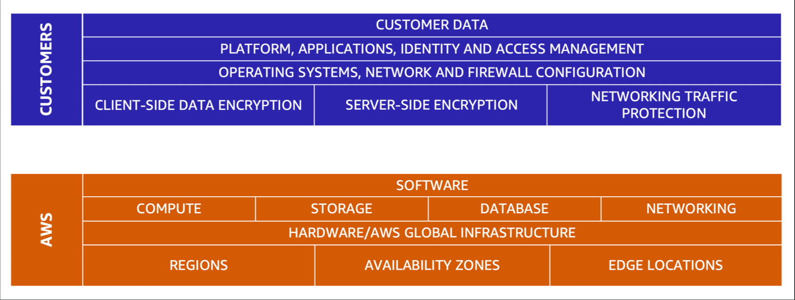

# AWS-Cloud-Practitioner-Essentials-Resume

This is a resume of our studies at AWS Cloud Practitioner Essentials training. All training is free and its available [here](https://explore.skillbuilder.aws/learn/course/external/view/elearning/134/aws-cloud-practitioner-essentials?src=detail2).

## Authors

- [Fernando Antonio Marques Schettini](https://github.com/FernandoSchett)
- [Orlando Mota Pires](https://github.com/orlandomotapires)

---

## Summary

- [Module 1 - Introduction to Amazon Web Services](#module-1---introduction-to-amazon-web-services) 
- [Module 2 - Compute in the cloud](#module-2---amazon-elastic-compute-cloud-amazon-ec2) 
- [Module 3 - Global Infrastructure and Reliability](#module-3---global-infrastructure-and-reliability) 
- [Module 4 - Networking](#module-4---networking) 
- [Module 5 - Storage and Databases](#module-5---storage-and-databases) 
- [Module 6 - Security](#module-6---security) 
- [ Module 7 - Monitoring and Analytics](#module-7---monitoring-and-analytics) 
- [Module 8 - Pricing and Support](#module-8---pricing-and-support)  
- [Module 9 - Migra](#) NOT DONE 
- [Module 10](#) NOT DONE 
- [Module 11](#) NOT DONE 

---

## **Module 1 - Introduction to Amazon Web Services**

### **Introduction**

&emsp;The purpose of Module 1 is to introduce the concept of cloud computing. Meaning that Cloud Computing is another step towards computing as a service.

### **The client-server model**

&emsp;A client-server model is a model based on client request and server response. You can think of a client as a person who wants to buy a coffee and server as the coffee shop selling it. The person asks for a coffee to the attendant and he go get the coffee and bring back to the person, a similar process occurs when a client asks for something for the server.

### **Cloud Computing**

&emsp;A short definition could be "The on-demand delivery of IT resources over the internet with pay-as-you-go pricing", the concept of cloud computing is the idea of heaving a independent server to store all the data a client would ever need. The main thing about cloud is the fact the client do not need to worry about having to deal with having a big room to store all the server machines and a whole IT team to manage them.</b>
&emsp;As well, the client only pays for the resources that he is using, when he is using, it means in the moment that he stops, he is not going to pay for it.  
&emsp;In general, when a client needs to store some data it is just necessary that the buy the amount of space he need at that moment and that is it, no need to worry about guessing the space it is going to be necessary on the future.  
&emsp;Lastly, the most beautiful thing about cloud-computing is the flexibility. While a client need, for example, a hundred servers, he can continue using it until he do not need then anymore, so he can just press a few clicks and return then to AWS, not needing to pay for them anymore. The other side can also happen, if the client need more servers he can just start using them without needing to warn the server-side before.

#### **Deployment models for cloud computing**

&emsp;When a costumer wants to migrate their application in cloud, there will be different approaches for each system in deployment process, based on the peculiarities for their system. Thus, there are three types(models) cloud computing deployments.

- Cloud-based deployment: 
&emsp;In cloud-based deployments models, you will run all parts of the application in the cloud, as so, you can migrate existing applications to the cloud or build and design new applications. 
&emsp;Therefore, your application can use virtual servers, database and networking components fully allocated and managed by AWS servers, based on cloud computing.

- On-premises deployment: 
&emsp;In On-premises deployments models, also know by  private cloud deployment, the costumer will deploy only their own resources, live physical servers for example, into cloud, in that way, he will be able to use cloud resource management tools to increase resource utilization. 
&emsp;This model is used when the costumer has an legacy IT infrastructure, therefore, he cant migrate all parts of the application to the cloud, like the cloud-based deployment. 
&emsp;The advantage of this type of model, is that the costumer will outsource all resource management from his own responsibility, increase resource utilization, based on application management and virtualization technologies. 
- Hybrid deployment: 
&emsp;In Hybrid deployments models, as the name suggests, will connect cloud based resources to on-premises infrastructure. 
&emsp;This model usually is used when, for example, due to government regulations require your business to keep certain records on premises. In this model, some parts of the application are on cloud and others, don't. 

#### **Benefits of cloud computing**

- Trade up front expense for variable expense:  
&emsp;Upfront expense refers to data centers, physical servers, and other resources that you would need to invest in before using them. Variable expense means you only pay for computing resources you consume instead of investing heavily in data centers and servers before you know how you’re going to use them.  
&emsp;By taking a cloud computing approach that offers the benefit of variable expense, companies can implement innovative solutions while saving on costs.  

- Stop Spending Money to run and maintain data centers:  
&emsp;As said before, when using cloud-computing to store data, the client do not need to worry about maintaining a whole data center working. In this way, being able to focus on what really matters. 

- Stop Guessing capacity: 
&emsp;With cloud computing, you don’t have to predict how much infrastructure capacity you will need before deploying an application. 

- Benefit from massive economies of scale: 
&emsp;Due to the usage from hundreds of thousands of customers, cloud-computing became cheaper then on-premises deployment. Therefore, AWS cloud services can achieve higher economies of scale. 

- Increase speed and agility: 
&emsp;The flexibility of cloud computing makes it easier for you to develop and deploy applications. By comparison, cloud computing enables you to access new resources within minutes. 

- Go global in minutes: 
&emsp;You can use AWS global infrastructure to deploy your cloud-based application in all local in the world, with low latency and just some clicks. 

---

## **Module 2 - Amazon Elastic Compute Cloud (Amazon EC2)**

### **Introduction**

&emsp;Amazon Elastic Compute Cloud (Amazon EC2) is a core part of the cloud computing platform. Amazon EC2 enables you to launch, connect and then use cloud instances at AWS servers. Its also good to mention, that EC2 works based on Containers as a Service (CaaS) concepts. 
&emsp;EC2 is the part AWS cloud computing platform that allows you to use resource vertical scaling, It means that you get more CPU and memory for your instance with a few clicks. It means that a Hypervisor[2] at AWS servers controls with virtualization technologies (Virtual Machines) how many resources your instance will consume. 
&emsp;You can run multiples instances with EC2, sharing the same resources running different things, like Windows, linux, databases etc. This concept is called Multitenancy. 
&emsp;Its important to know that each EC2 instance does not know that the other exist, they are isolated from other instances. 
&emsp;Furthermore you can also determine networking aspects of your instance like types of request or  accessibility configuration. 

### **EC2 Instance Types**

&emsp;Starting from the principle that EC2 instances can be used to various purposes, Amazon developers created various instance types, that can more suitable for each situation. There are 5 instances types: 

- General purpose instance: 
&emsp;Offers a balance of compute, memory, and networking resources. 

- Compute optimized instances:  
&emsp;Focus on high-performance processing such as applications, gaming and web servers. It also can be used for batch processing workloads that require processing many transactions in a single group. 

- Memory optimized instances: 
&emsp;They are designed to deliver fast performance for workloads that process large datasets in memory. As a consequence, its also used at high-performance databases or when you have workloads that involves performing real-time processing of a large amount of unstructured data. 

- Accelerate computing instances: 
&emsp;Accelerated computing instances use hardware accelerators, or coprocessors, to perform some functions more efficiently than is possible in software running on CPUs. Examples of these functions include floating-point number calculations, graphics processing, and data pattern matching.
 

- Storage optimized instances: 
&emsp;Storage optimized instances are designed for workloads that require high, sequential read and write access to large datasets on local storage. Examples of workloads suitable for storage optimized instances include distributed file systems, data warehousing applications, and high-frequency online transaction processing (OLTP) systems. 
&emsp;In computing, the term input/output operations per second (IOPS) is a metric that measures the performance of a storage device. It indicates how many different input or output operations a device can perform in one second. Storage optimized instances are designed to deliver tens of thousands of low-latency, random IOPS to applications.  

### **Amazon EC2 pricing**

&emsp;There are several ways to price EC2 instance uses. 

- On-Demand: 
&emsp;They are ideal for short-term, irregular workloads that cannot be interrupted. No upfront costs or minimum contracts apply.The instances run continuously until you stop them, and you pay for only the compute time and resources that you use. Ideal for entrance on AWS cloud computing. 

- Amazon EC2 Savings Plans: 
&emsp;This type of pricing is really useful when having a consistent amount of compute usage for 1-year or 3-year. Those are just the two kinds of plans existent in Amazon EC2 Savings Plans, this term commitment results in savings of up to 72% over On-Demand costs.  
&emsp;Any usage up to the commitment is charged at the discounted Savings Plan rate (for example, $10 an hour). Any usage beyond the commitment is charged at regular On-Demand rates. 

- Reserved Instances: 
&emsp;Reserved Instances are a billing discount, based on plans, applied to the use of On-Demand Instances in your account. It means that all On-demand instance you're gonna launch in a pre-determined time are gonna be cheeper. 

- Spot Instances: 
&emsp;Its a cheap alternative, although an Spot Instance, if capacity is no longer available or demand for Spot Instances increases, your instance may be interrupted or not even launched at all.   

- Dedicated Hosts: 
&emsp;They are are physical servers with Amazon EC2 instance capacity that is fully dedicated to your use. 

### **Scaling Amazon EC2**

&emsp;EC2 counts with Auto Scaling feature. Auto Scaling is the feature that allow you to get more resources or more instances as you need. It means that you gonna get what you need from AWS infrastructure when you need, and pay only for it. 
&emsp;Scalability is the key concept after Auto Scaling, and involves beginning with only the resources you need and designing your architecture to automatically respond to changing demand by scaling out or in. 

### **Amazon EC2 Auto Scaling**

&emsp;The Amazon EC2 Auto Scaling is a powerful tool when you need to change your amount of compute usage along some period of time. This tool enable you to automatically add or remove Amazon EC2 instances in response to changing application demand. By automatically scaling your instances in and out as needed, you are able to maintain a greater sense of application availability. Within Amazon EC2 Auto Scaling, you can use two approaches: dynamic scaling and predictive scaling.  

- Dynamic scaling responds to changing demand.
- Predictive scaling automatically schedules the right number of Amazon EC2 instances based on predicted demand.

> To scale faster, you can use dynamic scaling and predictive scaling together.  

#### **How it works?**

&emsp; First, you need to set up an auto scaling group. Then define the minimum number for EC2 instances, they are gonna launch as soon you create a auto scaling group. You want this number to be the minimum instances that your application needs to function. 
&emsp; Next, define de desired instance numbers, this number represents the number of instances that your application needs to function properly. 
&emsp; If you do not specify the desired number of Amazon EC2 instances in an Auto Scaling group, the desired capacity defaults to your minimum capacity. 
&emsp; At last, you can also define the maximum EC2 instances that your auto scaling group can launch. 

### **Elastic Load Balancing**

&emsp;Elastic Load Balancing is another feature that helps in traffic management between requests and instances. 
&emsp;This feature is responsible to balance the workload between all the running instances, this way you can guarantee that all instances have the same workload, so no instance has to carry the bulk of it. 
&emsp;Although Elastic Load Balancing and Amazon EC2 Auto Scaling are separate services, they work together to ensure efficiency. It means that when a new instance is launched or terminated, the auto scaling warns elastic load balancer, so he can re-balance the workload between all running instances. 
&emsp;Another Elastic Load Balancing advantage is that it acts as a single point of contact for all incoming web traffic to your Auto Scaling group. So each request doesn't need to know witch AWS instance is online. 

### **Messaging and queuing**

&emsp;Sometimes, there might be some troubles between receive requests and process then. This might occur because when the request arrived, an EC2 instance might be occupied processing other request. In Monolithic systems, the request is going to be lost or the system would fail. Thats why AWS works with low cohesion systems, like microservers. 

#### **Monolithic applications and microservices**

&emsp;The concept of an monolithic application is having all components the application needs to function together, those components might include databases, servers, the user interface, business logic, and so on. In this approach to application architecture, if a single component fails, other components fail, and possibly the entire application fails. 
&emsp;Otherwise, monolithic concept is the opposite of microservices, while the first is based on only one system with all components working together, the last one is focused on having the minimum amount of components together, and maximize the modularization.  
&emsp;For a microservices works properly is necessary, first of all, communication between the singular systems (components). It is simple to understand that when you have all components together the communication between each component is easier, but when you go for microservices, this became, at the same time, the problem and the solving of your situation. This occurs because the message trading is crucial to make the microservice a better way to maintain a big system, but at other side is the difficulty when using this kinda system. 

#### **Managing Messages**

&emsp;As a solution to managing messages between requests managers and system instances, AWS provide two services for managing messages: Amazon Simple Notification Service (Amazon SNS) and Amazon Simple Queue Service (Amazon SQS). 
&emsp;SNS is a feature based on subscribe and publisher, in this manner a publisher can publish a message at a topic (witch is a channel for a type of messages), and afterwards all subscribers that are attached to that topic will be notified with the new message. If a publisher wants to send another message, he can publish again at the same topic. 
&emsp;SQS works as a simple queue-like buffer, that requests can be lined up and be processed according to system capacity. 

### **Additional compute services**

#### **Serverless computing**

&emsp;The term “serverless” means that your code runs on servers, but you do not need to provision or manage these servers. With serverless computing, you can focus more on innovating new products and features instead of maintaining servers. 
&emsp;The main thing about serverless computing is the scalability and capacity of adjusting the applications needing according to the time. 

#### **AWS Lambda**

&emsp;AWS Lambda is a serverless service to run codes in the cloud. Its designed for quick process, up to fifteen minutes. 
&emsp;It works based on trigger systems. When you upload code, you will also set up a trigger based on event sources, then, when the trigger is activated the code runs automatically,all with zero administration. 

#### **Containers**

&emsp;Containers provide you with a standard way to package your application's code and dependencies into a single object. This manner of sharing environment is quick and simple, saving much time and patience.  
&emsp;A simple way to understand the importance of containers is imagining that two teams want to share their applications, but team A has different environment than team B, so to A's application work, B need's to install all A's dependencies and softwares, check their versions and in worst cases, uninstall other versions installed on B's. All this process can cost many time and is open to many mistakes, so been able to avoid them using containers is a cool solution.  

#### **Containers Orchestration**

&emsp;You can run Containers inside AWS instances, and when having a lot of instances, with a lot of containers, you need to manage containers inside the instances. You can orchestrate then manually, but its very complex and laborious. So AWS prepared two services for containers orchestration in cloud: Amazon Elastic Container Service (Amazon ECS) and Amazon Elastic Kubernetes Service (Amazon EKS)., 
&emsp;With Amazon ECS you can run and scale containerized applications on AWS and use ECS's API that calls to launch and stop Docker-enabled applications. 
&emsp;With Amazon EKS you can run and scale containerized applications on AWS and use EKS's API that calls to launch and stop Kubernetes-enabled applications. 

#### **AWS Fargate**

&emsp;AWS Fargate compute engine for containers service type. When you are going to use containers at your instance, you can use EC2 and manually manage your instances or you can let Fargate takes on that responsibility for you, meaning its a serverless service.  

---

## **Module 3 - Global Infrastructure and Reliability**

### **Introduction**

&emsp;AWS cloud computing services counts on a global infrastructure, with multiple server and data centers around the world. It is important for security and reliability. 
&emsp;If one AWS data center shuts downs for any reason, costumers applications won't stop working because they can host the same applications  at other data centers with different EC2 instances. 
&emsp;As well, if a costumer wants to host their application in another local of the planet to ensure low latency they can. 

### **AWS Regions**

&emsp;In AWS, a Region is a geographical area that contains AWS resources, this resources can be the availability zone. 
&emsp;When selecting a region its important you should remember: 

- Compliance: 
&emsp;When looking at cloud computing, there is a lot of rules and regiments that must be followed to set your application in a server, those therms are part of the Compliance of that region. For example, if you want to set your application in São Paulo, Brazil, you need to follow the Compliance of the São Paulo boundaries. 

- Proximity to Costumers: 
&emsp;You need to Select a region that is close to your costumers, that way, you will host your application with lower latency. 

- Available Services within a Region: 
&emsp;When AWS has something new to implements, they do it by parts. That way, some regions might have some services that others don't. 

- Pricing: 
&emsp;Some regions are more expensive then others, taxes at Brazil make it more costly to install the same Infrastructure compared to other places.  

### **Availability Zones**

&emsp;An Availability Zone is a single data center or a group of data centers, they are like subdivisions inside the regions. 
&emsp;Availability Zones are located tens of miles apart from each other. This is close enough to have low latency between Availability Zones. However, if a disaster occurs in one part of the Region, they are distant enough to reduce the chance that multiple Availability Zones are affected. 
&emsp;Its always important to run your application in multiple availability zones, far from each other, using more then on EC2 instance. So when something happens, you an count on another server, located in another building. 

### **Amazon Cloudfront**

&emsp;AWS also counts with a CDN service called Amazon Cloundfront they are based on Edge locations to delivery a low latency communication between two distant client and server. 
&emsp;The idea behind edge locations is to cache information from distance places. So, when someone needs to access data from an server that is too far, they can just request for the cached information on the edge locations. 

### **AWS OutPosts**

&emsp;AWS can also use AWS OutPosts to get AWS inside you business building. It means the AWS will install a new mini regions inside you business, to fulfill special needs that you might need. Using this tool AWS has completely operational control and hundred percent of AWS features will be available. 

### **Ways to interact with AWS services**

- AWS Management Console: 
&emsp;It is the API used  to interact with AWS services with visual assistance. 

- AWS Command Line: 
&emsp;It is the API used as a way to interact with AWS services with command line, in terminal. Good for automation with scripts. 

- AWS Software Development Kits: 
&emsp;It is the API used as a way to interact with AWS services with programing languages. AWS provides documentation and sample code for each supported programming language. 

### **AWS Elastic Beanstalk**

&emsp;With AWS Elastic Beanstalk, you provide configuration settings. In this way, Elastic Beanstalk do all the work for you, calling the respective API's to build the desired cloud ambient, facilitating launching your application.. 

### **AWS CloudFormation**

&emsp;With AWS CloudFormation you can use pre-determined templates to build an environment by writing lines of code instead of using the AWS Management Console. In this manner, you can treat your infrastructure as code by using tools as json's to describe your infrastructure in a declarative manner.  

---

## **Module 4 - Networking**

### **Introduction**

&emsp;We don't want to everybody connect with ours resources at AWS data center. So, we gotta have services to control networking flowing at EC2 instances, databases and Elastic Load Balancing 

### **Amazon VPC - Virtual Private Cloud**

&emsp;To control access at AWS resources, we got VPC, capable of creating subnets and gates, thus making access private or public. There are 3 ways to connect the resources to the client, via network: 

- Internet Gateway: 
&emsp;Allows public traffic from the internet to access your VPC, you attach an internet gateway to the VPC. 

- Private Gate: 
&emsp;Allows protected internet traffic to enter into the VPC. That means only people authorized will have access. 

- AWS Direct Connect: 
&emsp;If you want low latency, you can choose AWS Direct Connect to get a dedicated network connected to AWS data centers. In this way, only people authorized will have access. 

**PS: Only control access based on connection.

#### **ACL's and Security Groups**

&emsp;When connected to VPC, there are two more steps, until your packet really goes inside one EC2 instance and get processed. 
&emsp;First, the packet needs to enter the subnet inside the VPC. When entering, the packet type and where did he came from will be checked by one ACL, per default, all packets are allowed to enter. ACL's are stateless, it means it wont remember who's allowed to get in, meaning that the packet will be checked when he enters the subnet and when he leaves the subnet. 
&emsp;Inside the subnet, your packet needs to enter EC2 security group. Differently from the last one, this way to access is stateful, all the packets that enter the EC2 are on a security group and will be remembered on they way out, no need to check when leaving.
 

### **Amazon Route 53**

&emsp;Amazon Route 53 is a highly available and scalable Domain Name System (DNS) web service. Route 53 connects user requests to Internet applications running on AWS or on-premises. It converts the domain name to IP address so the user can connect it. It uses other informations, like Geographyc position to make the best IP possible to access with low latency.. 

## **Module 5 - Storage and Databases**

### **Introduction**

&emsp; Your business might have necessity of getting and storing information and data. AWS got you.  

### **Amazon Elastic Block Store**

&emsp;When starting a new EC2 instance, you can use EC2 own memory. This memory is temporary, and goes away as soon the instance is terminated. All memory is also stored in blocks. 
&emsp;To, to fix that, AWS has EBS, that allow you to get memory from their hard drives. It keeps in a long term data, and its independent from EC2 life cycles. 

#### **SnapShots**

&emsp;The main reason for using the Amazon EBS is to keep your data persistent, this way you are going to need backups to have it successfully secure. Here is where the SnapShots came in, this is a backup service that you can use to make incremental backup's of your own data. 

### **Amazon Simple Storage Service (Amazon S3)**

&emsp; There is two kinds of storage, objects and blocks. The first one is defined by everything that you store is considered a complete object and treated like that, having the data, metadata and key. The bad thing about the object storage is when you need to update a specific part of you file, but you can't do it with this kind of storage. Object storage only allows you to send the whole object to update the last one, so if you have a large file to update, gonna have to send it all again, the service of AWS the provides this kind of storage is Amazon S3. To solve this problem, the second guy came's in, the block storage. With the block storage you can change a specific part of the file without having to re-upload the whole file again.  

- S3 Standard: 
&emsp;Nice option when need frequently accessed data, this guy is really useful of many use cases such as websites, content distribution, and data analytics.  

- S3 Intelligent Tiering: 
&emsp; Good choice when heaving files have changing access patterns. Amazon S3 will automatically move your file between the perfect accessing tiers types. 

- S3 Glacier: 
&emsp;Glacier is tier focused on retrieving data. In this tier type, you can choose based on how often do you retrieve data. Inside Glacier, you choose between the best tier. You can retrieve a data instantly, or within hours of upload. 

- S3 Outposts: 
&emsp;Amazon S3 Outposts delivers object storage to your on-premises AWS Outposts environment. 

#### **Comparing Amazon EBS and Amazon S3**

&emsp;EBS and S3 are two different ways to storage data. The main difference between thenz is that EBS works with block-type memory writing, when S3 works with object-type memory writing. 
&emsp;When your gotta have heavy files that are always changing, go for EBS it will only change and upload the archive modified part. S3 will upload the hole new object every time a new part is modified. 
&emsp;Also, S3 is very good at reading a lot of files, looking for something. 

### **Amazon Elastic File System (Amazon EFS)**

&emsp;Amazon EFS is another service for data storage. Differently from Amazon EBS and Amazon S3 it's based on files, not blocks or objects, and it's main purpose is to be accessible from any EC2 instance at the region, writing and reading at the same time. Also, than storage will be dynamically adjusted for the amount of data necessary. 

### **Amazon Relational Database Service (Amazon RDS)**

&emsp;Amazon RDS can provide the classic relational way to store data in databases, it means that the data will be stored with services such as hardware provisioning, database setup, patching, and backups. The engines that RDS uses are the most common used in the market, they can be PostgreSQL, MySQL, MariaDB, OracleDatabase, Microsoft SQL Server, Amazon Aurora and so on. Other feature provides by RDS is integrating Amazon RDS with other services to fulfill your business and operational needs.  

#### **Amazon Aurora**

&emsp;Amazon Aurora is an enterprise-class relational database.It Reduces unnecessary input/output (I/O) operations, while ensuring that your database resources remain reliable and available.  

### **Amazon DynamoDB**

&emsp; Amazon DynamoDB is a nonrelational database or "NoSQL databases", it means that DynamoDB don't use the classic SQL to manipulate the data, one type of structural approach for nonrelational databases is key-value pairs. It's serverless and has automatic scaling, it means that you don't have to provision, patch or manage services, and no need to keep a eye on the scaling. 

#### **Comparing Amazon EDS and Amazon DynamoDB**

&emsp; Comparing the two Amazon data management services, we can simplify: use RDS when you need to relate data have and recovery provided. Use DynamoDB when you need high scalability, capable of millions of access at a short period of time, standardized data
 data and your data doesn't need to be related at all. 

### **Amazon Redshift**

&emsp;Amazon Redshift is a data warehousing service that you can use for big data analytics. It offers the ability to collect data from many sources and helps you to understand relationships and trends across your data. 

### **AWS Database Migration Service (AWS DMS)**

&emsp;With AWS DMS, you move data between a source database and a target database. The source and target databases can be of the same type or different types. During the migration, your source database remains operational, reducing downtime for any applications that rely on the database.  
&emsp;You can also combining several databases into a single database, test applications against production data without affecting production users and send ongoing copies of your data to other target sources instead of doing a one-time migration. 

### **Additional database services**

&emsp;There are more databases type, each one specific for the type of work 

- Amazon Document DB: 
&emsp;Amazon Document DB is a service that enable you to store JSON files and manage them in a easy way, simplifying the architecture. 

- Amazon Neptune: 
&emsp;Amazon Neptune is a graph based database, it is really useful at social media and recommendation systems. Differently from the others services that uses SQL and NoSQL this guy uses SPARQL, a standardized language for querying RDF graphs.  

- Amazon Managed Blockchain: 
&emsp; A service that you can use to create and manage blockchain networks with open-source frameworks, also good for banking due to immutability. 

- Amazon Quantum Ledger Database (Amazon QLDB): 
&emsp; Use it when you need a complete history of all the changes that have been made to your application data, good for banking, where you need to register all changes and large amounts of data. 

- Amazon ElastiCache: 
&emsp; It's one type of database accelerator, were you can pay for more performance, adding more cache to database systems, improving the read times of common requests. .  

- Amazon DynamoDB Accelerator (DAX): 
&emsp;Other database accelerator, build specifically for DynamoDB and also cache based. 

## **Module 6 - Security**

### **Introduction**

&emsp;Of course, when are you talking about a service, security its a key problem. So security is thing guaranteed by AWS and the user, each one with your own responsibility. 

### **Shared responsibility model**

&emsp;The shared responsibility model divides into customer responsibilities (commonly referred to as “security in the cloud”) and AWS responsibilities (commonly referred to as “security of the cloud”). 
&emsp;You can think of this model as being similar to the division of responsibilities between a homeowner and a homebuilding. The builder (AWS) is responsible for constructing your house and ensuring that it is solidly built. As the homeowner (the customer), it is your responsibility to secure everything in the house by ensuring that the doors are closed and locked.  

     
    <strong>Figure 1 - AWS Figure Model</strong> 

 

- Customers Responsibilities: 
&emsp;You as a costumer has to manage the data IN the cloud. You are responsible for managing security requirements for your content, including which content you choose to store on AWS, which AWS services you use, and who has access to that content. You also control how access rights are granted, managed, and revoked. In general the costumers responsibility is on data, application and operating system. 

- AWS Responsibilities: 
&emsp;Guards, energy and all things related to physical maintenance of AWS data centers are AWS responsibilities. As well as network security, and HyperVisor administration inside AWS servers. 

&emsp;This way, you are responsible for security in the cloud while AWS is responsible for security of the cloud. 

### **User permissions and access (IAM)**

&emsp;AWS Identity and Access Management (IAM) its another AWS service and enables you to manage access to AWS services and resources securely. When creating your AWS account, there are some entities you have to manage with the best practices to ensure security. They are: 

- IAM Users: 
&emsp;When you create your AWS, your logged with root user. This user has all permissions allowed by default. Do not use the root user for everyday tasks. Instead, use the root user to create your first IAM user and assign it permissions to create other users. 
&emsp;Its recommended that you create individual IAM users for each person who needs to access AWS and that you enable Multi-factor authentication to get another security layer based on a code received by a specific device.   

- IAM Policies: 
&emsp;An IAM policy is a document that allows or denies permissions to AWS services and resources. You can also manage the level of that access you granted to a specific user, group or even a role. When setting the privileges that a certain policy will have it's necessary to look ate the best practice, in this case is to follow the security principle of least privilege when granting permissions. By following this principle, you help to prevent users or roles from having more permissions than needed to perform their tasks.  

- IAM Groups: 
&emsp;IAM Group is a group of users, when you assign an IAM policy to a group, all users in the group are granted permissions specified by the policy. Instead of assigning permissions to users one at a time, the owner can create a "Developers" IAM group. 

- IAM Roles: 
&emsp;An IAM role is an identity that an user can assume to gain temporary access to permissions. Its used to users that need to get access to different resources temporarily, instead of long-term for each type of job. 

### **AWS Organizations**

&emsp;AWS Organizations are another AWS service to manage different accounts. Differently from IAM that works with users in the same account, this service works managing different AWS accounts. 
&emsp;You can centrally control permissions for the accounts in your organization by using service control policies (SCPs). SCPs enable you to place restrictions on the AWS resources for different accounts. 
&emsp;In AWS Organizations, you can group accounts into organizational units (OUs) to make it easier to manage accounts with similar business or security requirements. When you apply a policy to an OU, all the accounts in the OU automatically inherit the permissions specified in the policy. 

### **AWS Artifact**

&emsp;You can use AWS Artifact for 2 main reasons, Agreements or Reports. With Agreements you can review, accept, and manage different types of agreements for an individual account and for all your accounts in AWS Organizations based on your business needs. 
&emsp;With the AWS Artifact Reports, you are able to get more information about your responsibility for complying with certain regulatory standards. Reports provide compliance reports from third-party auditors. These auditors have tested and verified that AWS is compliant with a variety of global, regional, and industry-specific security standards and regulations. 
&emsp;You can also contact Customer Compliance Center that contains resources to help you learn more about AWS compliance and have access to compliance whitepapers and documentation and a auditor learning path. 

#### **Customer Compliance Center**

&emsp;The Customer Compliance Center contains resources to help you learn more about AWS compliance. In the Customer Compliance Center, you can read customer compliance stories to discover how companies in regulated industries have solved various compliance, governance, and audit challenges. 

### **Denial-of-service attacks**

&emsp;A denial-of-service (DoS) attack is a deliberate attempt to make a website or application unavailable to users. We have a lot of DDoS attack types: 

- Distributed denial-of-service attacks: 
&emsp;They are the most common, they happen when a lot of machines requests things from your application, overloading it. Usually, they use zombies typed machines. AWS prepared AWS Shield, who's responsible for protect your applications against this type of DDoS. 

- UDP Flood:  
&emsp;This DDos Attack is based on using a public service to overload the application. For example let's think about a weather service, you can send request to get information about the weather and the application will send you a bunch of data. If a hacker send a request to the application and set your IP to receive the response, your application might get overloaded by the massive amount of data the application is returning. AWS has already a solution for this kind of problem, the Security Groups. With the Security Groups you can set witch requests is going to be accepted or not, avoiding the UDP Flood attack.  

- Slowloris Attack: 
&emsp;This attack happens when a hacker send a request to the application. The request goes with low latency (lagged) on purpose, because of that it also prevents other requests to be done. Elastic Load Balancer its the solution for this attack, because ELB waits for the entire request to be done, managing the requests. 

### **AWS Key Management Service (AWS KMS)**

&emsp;AWS Key Management Service (AWS KMS) enables you to perform encryption operations through the use of cryptographic keys. A cryptographic key is a random string of digits used for locking (encrypting) and unlocking (decrypting) data. You can use AWS KMS to create, manage, and use cryptographic keys. You can also control the use of keys across a wide range of services and in your applications. With AWS KMS, you can choose the specific levels of access control that you need for your keys. With AWS KMS, you can choose the specific levels of access control that you need for your keys. For example, you can specify which IAM users and roles are able to manage keys. 

### **AWS WAF**

&emsp;AWS WAF is a web application firewall that lets you monitor network requests that come into your web applications. AWS WAF works together with Amazon CloudFront and an Application Load Balancer and works with a access control list that has all the blocked ip's listed, whenever a request comes, the WAF is able to check if that IP is on the block list. 

### **Amazon Inspector**

&emsp;To perform automated security assessments on your applications, you can use Amazon Inspector. Inspector is another AWS service that by runs automated security assessments generating a list of security findings each one with recommendation for how to fix it. 

### **Amazon GuardDuty**

&emsp; GuardDuty is another autonomous service for monitoring your AWS account and network. You can review detailed findings about them from the AWS Management Console. AWS Lambda functions can be triggered as soon as GuardDuty finds threats. 

## **Module 7 - Monitoring and Analytics**

### **Introduction**

&emsp;It's important to have monitoring tools to check how your system is doing during the day, and based on that take actions to get better performance and troubleshooting. 

### **Amazon CloudWatch**

&emsp;Amazon CloudWatch is a web service that enables you to monitor and manage various metrics and configure alarm actions based on data from those metrics. 
&emsp;With CloudWatch you can set alarms to send notifications about your instances when, for example, the CPU use percentage is over 80%, the temperature is too high. You can also use the CloudWatch to create a complete dashboard with many information about your business, aggregating all information in just one place. 
&emsp;In that way, you gain visibility over your system improving mean time to resolution and total costumer ownership. 

### **AWS CloudTrail**

&emsp;AWS CloudTrail records API calls for your account. The recorded information includes the identity of the API caller, the time of the API call, the source IP address of the API caller, and more. Events are typically updated in CloudTrail within 15 minutes after an API call. 
&emsp;Within CloudTrail, you can also enable CloudTrail Insights. This optional feature allows CloudTrail to automatically detect unusual API activities in your AWS account. 

### **AWS Trusted Advisor**

&emsp;AWS Trusted Advisor is a web service that inspects your AWS environment and provides real-time recommendations in accordance with AWS best practices. It will warn you if something is wrong, with security, fault tolerance, performance, cost optimization and service limits. 

## **Module 8 - Pricing and Support**

### **Introduction**

&emsp;This module talks about pricing in each AWS resource and service. It's important to know exactly how much you're gonna pay for AWS Cloud Services. 

### **AWS Free Tier**

&emsp;AWS offers some free services, under some policies: "Always Free", "12 Months Free" and "Trials". They are goos for testing AWS services and trying get you downscale projects in cloud.  

### **AWS Pricing and Expense Control**

&emsp;In general, AWS has three types of pricing: 

- Pay for what you use: 
&emsp;For each service, you pay for exactly the amount of resources that you actually use, without requiring long-term contracts or complex licensing.   

- Pay less when you reserve: 
&emsp;AWS offers you a discount if you reserve a service. 

- Pay less with volume-based discounts when you use more: 
&emsp;Some services offer tiered pricing, so the per-unit cost is incrementally lower with increased usage. More you use, more discount you get. 

&emsp;Based on these concepts, you can use AWS Pricing Calculator to get a estimate for the cost of your case uses. And use Billing dashboard to know where exactly you're spending your money and use AWS Budgets to plan your service usage, service costs, and instance reservations. 
&emsp;For example, EC2 you pay for only the compute time that you use while your instances are running, with Amazon S3 the number of requests to add, copy or retrieve objects into a bucket and the space of storage space used counts for the pricing and with AWS Lambda, you are charged based on the number of requests for your functions and the time that it takes for them to run. 
&emsp;AWS has Consolidated billing feature, it means that if a company has more than one account, they can use this feature to get a single bill from all accounts. Consolidated billing also has the capability track each account expenses and usage. 
&emsp;If you're still having trouble with money expending, you CAN use AWS Cost Explorer to see your costs visualize, understand, and manage your AWS costs and usage over time. 

### **AWS Support plans**

&emsp;There are five supports plans that you as a costumer can use to get support from AWS. 

- Basic: 
&emsp;Its free for all AWS customers. Access to whitepapers, documentation, AWS Personal Health Dashboard and support communities. With Basic Support, you can also contact AWS for billing questions and service limit increases. But you have access to a limited selection of AWS Trusted Advisor checks. 

- Developer: 
&emsp;Best practice guidance, client-side diagnostic tools and Building-block architecture support, which consists of guidance for how to use AWS offerings, features, and services together. 

- Business: 
&emsp;Use-case guidance to identify AWS offerings, features, and services that can best support your specific needs, all AWS Trusted Advisor checks, limited support for third-party software, such as common operating systems and application stack components. 

- Enterprise On-Ramp: 
&emsp;A pool of Technical Account Managers to provide proactive guidance and coordinate access to programs and AWS experts, a Cost Optimization workshop (one per year), a Concierge support team for billing and account assistance, tools to monitor costs and performance through Trusted Advisor and Health API/Dashboard, consultative review and architecture guidance (one per year),infrastructure Event Management support (one per year), support automation workflows,30 minutes or less response time for business-critical issues 

- Enterprise Support: 
&emsp;In addition to all features included in the Basic, Developer, Business, and Enterprise On-Ramp support plans, customers with Enterprise Support have access to a designated Technical Account Manager, a Concierge support team, Operations Reviews and tools, Training and Game Days and Tools to monitor costs and performance through Trusted Advisor and Health API/Dashboard.  
&emsp;The Enterprise plan also provides full access to proactive services, which are provided by a designated Technical Account Manager, some examples are Consultative review and architecture guidance, Infrastructure Event Management support, Cost Optimization Workshop and tools, Support automation workflows, 15 minutes or less response time for business-critical issues. 

**PS: All pay-by-the-month plans have the benefits of Basic plan.**

### **AWS Marketplace**

&emsp;AWS Marketplace is a digital catalog that includes thousands of software listings from independent software vendors. You can use AWS Marketplace to find, test, and buy software that runs on AWS. Play Stored Like, AWS Marketplace offers products in several categories, such as DevOps, Data Products Professional Services Business Applications and so on.  

## **References**

1. <https://explore.skillbuilder.aws/learn/course/external/view/elearning/134/aws-cloud-practitioner-essentials?src=detail2>

2. <https://www.youtube.com/watch?v=FZR0rG3HKIk&ab_channel=IBMTechnology>
